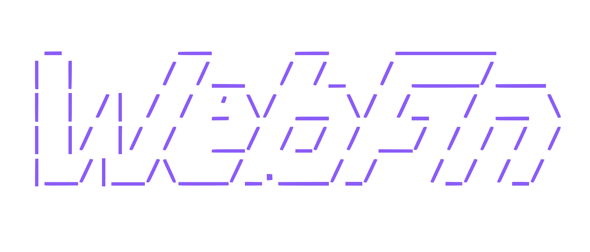
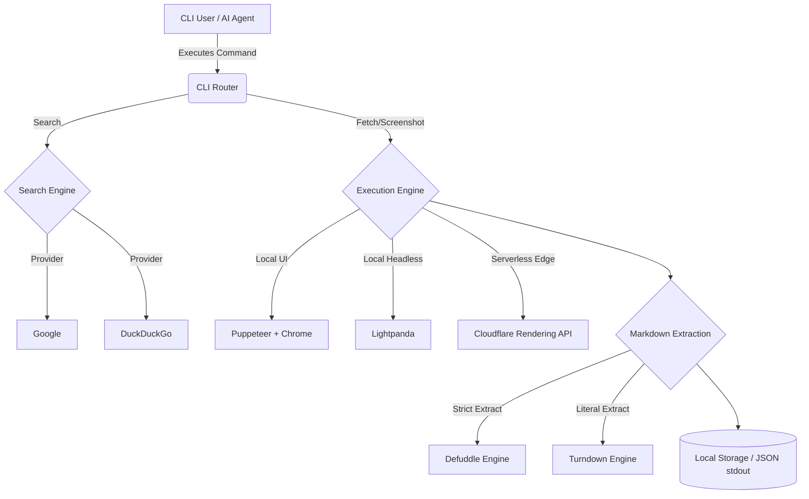

<div align="center">



  <p><b>Agent-oriented CLI for browser-backed search, fetch, and crawl workflows.</b></p>

  <p>
    <a href="https://nodejs.org"></a>
    <a href="#license"></a>
    <a href="#contributing"></a>
  </p>
</div>

---

## Overview

Webfn is the ultimate web data extraction tool designed specifically for **AI Agents** and **Automated Pipelines**.

Whether you need to bypass anti-bot protections, extract clean markdown from heavily javascript-rendered pages, or perform deep site crawls, Webfn provides a seamless and robust interface.

- **Search** the web and extract structured JSON results.
- **Fetch** rendered SPA pages and extract human-readable markdown.
- **Crawl** entire websites from sitemaps or internal links.
- **Screenshot** pages natively or via the cloud.
- **Auto-Detect** agent mode — outputs pure JSON when piped, rich CLI UI when in a terminal.

## Architecture



---

## Installation

```bash
# Install globally via npm
npm install -g webfn-cli

# Or via pnpm
pnpm add -g webfn-cli
```

Once installed, the `webfn` command is available globally:

```bash
webfn fetch https://example.com
webfn search "ai agents"
```

**No install needed with npx:**

```bash
npx webfn-cli fetch https://example.com
npx webfn-cli screenshot https://example.com --full
```

---

## Getting Started

Ensure you have [Node.js](https://nodejs.org/) installed, then:

```bash
pnpm install
pnpm build
```

Verify your environment dependencies:
```bash
pnpm dev doctor
```

## Agent-First Design

Webfn is built to be controlled by LLMs and Agents.

When stdout is **piped** (e.g., an AI agent calling the CLI), webfn automatically suppresses all progress bars and interactive UI, outputting a single, strictly formatted JSON envelope.

```bash
# Agent mode (auto-detected):
webfn fetch https://example.com | jq .page.title

# Force JSON in a TTY:
webfn fetch https://example.com --json

# Human-friendly rich output (default in terminal):
webfn fetch https://example.com
```

All JSON output follows a consistent format:

```json
{
  "ok": true,
  "command": "fetch",
  "page": { "title": "Example", "markdown": "..." },
  "browser": { "engine": "lightpanda", "headless": true },
  "files": [ ... ],
  "storage": { ... }
}
```

## Core Commands

```bash
# Search for a topic
webfn search "ai agents"

# Search and download the full HTML/Markdown of the top results
webfn collect "ai agents"

# Fetch a specific page and convert to markdown
webfn fetch https://example.com

# Take a full-page screenshot
webfn screenshot https://example.com --full

# Crawl a site up to a specific depth
webfn crawl https://example.com --depth 2 --max-pages 50
```

For comprehensive configuration and documentation, see **[docs.md](./docs.md)**.

## Built With

Webfn leverages powerful open-source libraries:
- **[Puppeteer](https://pptr.dev/)**: For headless browser automation and CDP control.
- **[Lightpanda](https://github.com/lightpanda-io/browser)**: For ultra-fast, memory-efficient headless execution.
- **[Cloudflare Browser Rendering](https://developers.cloudflare.com/browser-rendering/)**: For edge-based, serverless page evaluation.
- **[Commander.js](https://github.com/tj/commander.js)**: For robust CLI routing and option parsing.

## Contributing

Contributions are always welcome!

1. Fork the repository.
2. Create a new branch (`git checkout -b feature/amazing-feature`).
3. Commit your changes (`git commit -m 'Add some amazing feature'`).
4. Push to the branch (`git push origin feature/amazing-feature`).
5. Open a Pull Request.

Please ensure you run `pnpm run format` and verify your changes don't break the agent JSON output structures.

## License

This project is licensed under the MIT License - see the [LICENSE](LICENSE) file for details.
